# UC37.5 RAG Pipeline

A **Retrieval-Augmented Generation** pipeline purpose-built for structured engineering and technical documents — specifications, verification test reports, hardware interface requirement specifications, and similar. It ingests PDF and DOCX files, decomposes them into a semantically rich chunk hierarchy, embeds them into a vector store, and serves grounded, citation-backed answers through an interactive chat session or one-shot CLI queries. Every answer includes source citations, deterministic structural verification, and a hybrid confidence score so you can trust — and trace — what the system tells you.

---

## Table of contents

- [Architecture overview](#architecture-overview)
- [Quick start](#quick-start)
- [CLI reference](#cli-reference)
- [Pipeline stages](#pipeline-stages)
  - [Ingestion](#ingestion)
  - [Chunking](#chunking)
  - [Embedding](#embedding)
  - [Retrieval](#retrieval)
  - [Generation](#generation)
- [Interactive chat (REPL)](#interactive-chat-repl)
- [Project structure](#project-structure)
- [Configuration](#configuration)
- [Dependencies](#dependencies)
- [Evaluation](#evaluation)
- [Security model](#security-model)

---

## Architecture overview

The pipeline is organized as five sequential stages that transform raw documents into grounded, citable answers. Each stage is independently runnable via the CLI and produces persistent artifacts in the `cache/` directory, so you can re-run any stage without repeating earlier work.

```mermaid
flowchart TB
    subgraph INPUT["📄 Document Input"]
        PDF["PDF files"]
        DOCX["DOCX files"]
    end

    subgraph INGEST["Stage 1 — Ingestion"]
        SELECT["File selection\n(CLI / manifest / drop-folder)"]
        DEDUP["SHA-256 duplicate detection"]
        PARSE["Docling parser\n(+ optional OCR / VLM)"]
        FILTER["Post-processing filters\n(headers, TOC, logos, page numbers)"]
    end

    subgraph CHUNK["Stage 2 — Chunking"]
        TREE["Structural tree builder\n(heading hierarchy)"]
        CLASSIFY["Block classification\n(test case, requirement, table, prose, …)"]
        BUDGET["Token-budget rules\n(merge / keep / split)"]
        TIERS["Three-tier output\nTier 1: Document\nTier 2: Section\nTier 3: Atomic"]
    end

    subgraph EMBED["Stage 3 — Embedding"]
        ENRICH["Metadata-enriched text\n(doc type, module, heading, IDs)"]
        ADA["Azure OpenAI Ada-002\nembedding model"]
        CHROMA["ChromaDB persistent\nvector store"]
    end

    subgraph RETRIEVE["Stage 4 — Retrieval"]
        ANALYZE["Query analysis\n(classify, scope, abbreviations)"]
        EXACT["Exact identifier\nlookup"]
        HYBRID["Hybrid search\n(vector + BM25 → RRF)"]
        RERANK["Re-ranking\n(cross-encoder / LLM / none)"]
        CONTEXT["Context window assembly\n(hierarchy-aware expansion)"]
    end

    subgraph GENERATE["Stage 5 — Generation"]
        PROMPT["Prompt construction\n+ source manifest"]
        LLM["Azure OpenAI LLM\n(structured JSON output)"]
        CITE["Citation resolution\n(source IDs → real chunks)"]
        VERIFY["Structural verification\n(deterministic, no LLM)"]
        CONFIDENCE["Hybrid confidence scoring\n(retrieval + verification signals)"]
    end

    subgraph OUTPUT["💬 Output"]
        CHAT["Interactive REPL\n(/json, /text, /stats)"]
        ONESHOT["One-shot CLI\n(human-readable or JSON)"]
    end

    PDF --> SELECT
    DOCX --> SELECT
    SELECT --> DEDUP --> PARSE --> FILTER

    FILTER -->|"cache/markdown/"| TREE
    TREE --> CLASSIFY --> BUDGET --> TIERS

    TIERS -->|"cache/chunk/"| ENRICH
    ENRICH --> ADA --> CHROMA

    CHROMA -->|"cache/embed/"| ANALYZE
    ANALYZE -->|EXACT_LOOKUP| EXACT
    ANALYZE -->|SEMANTIC| HYBRID
    EXACT --> RERANK
    HYBRID --> RERANK
    RERANK --> CONTEXT

    CONTEXT --> PROMPT --> LLM --> CITE --> VERIFY --> CONFIDENCE

    CONFIDENCE --> CHAT
    CONFIDENCE --> ONESHOT

    style INPUT fill:#e8f4f8,stroke:#2196F3
    style INGEST fill:#fff3e0,stroke:#FF9800
    style CHUNK fill:#f3e5f5,stroke:#9C27B0
    style EMBED fill:#e8f5e9,stroke:#4CAF50
    style RETRIEVE fill:#fff8e1,stroke:#FFC107
    style GENERATE fill:#fce4ec,stroke:#E91E63
    style OUTPUT fill:#e0f2f1,stroke:#009688
```



---

## Quick start

**Prerequisites:** Python 3.10+, Azure OpenAI access (for embeddings and generation).

```bash
# 1. Clone and install dependencies
git clone <repo-url> && cd UC37.5
pip install -r requirements.txt

# 2. Configure credentials
cp .env.example .env          # Add your API keys and endpoints
#    Also verify config_V2025_05_31.json has correct Azure OpenAI deployments

# 3. Ingest a document
#    Drop a PDF or DOCX into input/, then:
python -m src.cli ingest

# 4. Chunk and embed
python -m src.cli chunk
python -m src.cli embed

# 5. Start asking questions
python -m src.cli chat
```

---

## CLI reference

All functionality is accessed through subcommands of `python -m src.cli`:

| Command | Description |
|---|---|
| `python -m src.cli ingest` | Parse PDF/DOCX documents into clean Markdown |
| `python -m src.cli chunk` | Re-chunk cached Markdown into a hierarchical segment structure |
| `python -m src.cli embed` | Embed chunks into the ChromaDB vector store |
| `python -m src.cli retrieve "query"` | Run a query through the retrieval pipeline and display results |
| `python -m src.cli generate "query"` | One-shot grounded question answering with citations |
| `python -m src.cli chat` | Interactive REPL session with runtime slash commands |
| `python -m src.cli evaluate-retrieval` | Compute IR metrics against a golden test set |
| `python -m src.cli evaluate-generation` | Compute generation quality metrics against a golden test set |

> Run any command with `--help` for full options.

---

## Pipeline stages

### Ingestion

Converts raw PDF and DOCX files into normalized Markdown using the [Docling](https://github.com/DS4SD/docling) library. Documents can be selected via explicit CLI paths/globs, a `manifest.json` with include/exclude rules (see [manifest.example.json](manifest.example.json)), or by dropping files into the `input/` directory. Every file is tracked by its **SHA-256 content hash** — identical files are skipped, modified files are re-ingested, and the registry persists across runs in `cache/meta/ingestion_registry.json`. Optional modes include **OCR** (EasyOCR for scanned pages) and **VLM** (Azure GPT-4.1 for figure/diagram description). Post-processing automatically strips headers, footers, TOC sections, logos, and residual page numbers. Output is written to `cache/markdown/{doc_id}.md`.

### Chunking

Decomposes each parsed Markdown document into a **three-tier hierarchy** modeled after the document's heading structure. The pipeline first builds a structural section tree from the Markdown headings, then classifies every content block by semantic type — test case, requirement, table, definition table, abbreviation table, prose, figure, or list. Token-budget rules (configurable; defaults target 200–500 tokens for Ada-002) control whether blocks are **merged** (below `min_tokens=50`), **kept whole**, or **split** at natural boundaries (above `max_tokens=800`). The resulting chunks are:

- **Tier 1 — Document:** One per file; holds extracted document-level metadata (title, document type, module name, revision).
- **Tier 2 — Section:** One per major heading; provides heading context and acts as a parent container.
- **Tier 3 — Atomic:** Leaf chunks (test cases, requirements, tables, prose, etc.) with rich metadata — heading path, section number, component IDs, cross-references, and type-specific fields.

Every chunk carries explicit parent/child links and a SHA-256 `chunk_id` so the retrieval layer can navigate the hierarchy at query time. Output is written to `cache/chunk/{doc_id}.json`.

### Embedding

Transforms Tier-3 atomic chunks into vector representations using **Azure OpenAI Ada-002** (`cl100k_base` tokenizer, 8191-token context window). Before embedding, each chunk's raw text is **enriched** with a structured metadata prefix:

```
[FVTR | DIM-V | Test Case | 5 VERIFICATION OF MECHANICAL CHARACTERISTICS]
FVTR_OPT_01: Labelling and assembly — Result: Passed
---
<raw chunk text>
```

This prefix injects document type, module name, chunk type, heading context, and type-specific identifiers directly into the embedding input — improving retrieval accuracy when queries reference document types, module names, or specific IDs. Vectors are upserted into a **persistent ChromaDB** collection (`cache/embed/`) with filterable metadata fields for scope-constrained search.

### Retrieval

Handles the full path from a natural-language query to a hierarchy-aware context window ready for generation. The stage operates in four phases:

1. **Query analysis** — Classifies the query as `EXACT_LOOKUP`, `SCOPED_SEMANTIC`, or `UNCONSTRAINED`. Extracts identifier patterns (e.g. `FVTR_FUNC_13`), scope doc IDs, and a semantic remainder. Acronyms are expanded using an abbreviation table built from the ingested corpus.
2. **Search** — For exact lookups, a direct identifier match against chunk metadata (field match → semicolon-delimited field scan → full-text scan). For semantic queries, a **hybrid search** fuses Ada-002 vector similarity with BM25 keyword relevance via **Reciprocal Rank Fusion** (RRF, k=60). Scope-aware filtering constrains the search to relevant documents when the query analysis detects a scoped intent.
3. **Re-ranking** — Narrows the broad candidate set (default 20) to the final top-k (default 8) using a pluggable re-ranker: **cross-encoder** (`ms-marco-MiniLM-L-6-v2`, ~80–150 ms for 20 candidates), **LLM** (Azure GPT-4.1-mini), or **none** (passthrough).
4. **Context assembly** — Expands selected chunks into a hierarchy-aware context window: groups chunks by parent section, attaches section headings and Tier-2 context, injects preceding prose for tables and figures, and formats everything as a numbered source manifest for the generation prompt.

In evaluation against a 45-query golden test set, the retrieval pipeline achieved **Recall@8 of 0.89** and **MRR of 0.92** across all query types with cross-encoder re-ranking.

### Generation

Produces grounded, citation-backed answers through a seven-step pipeline:

1. **Retrieval** — Fetches relevant context via the retrieval stage.
2. **Empty-context guard** — If no evidence is found, the pipeline abstains immediately without making an LLM call, returning a canned "insufficient information" response.
3. **Prompt construction** — Builds a grounded prompt with a numbered source manifest so the LLM can cite specific chunks by ID.
4. **LLM call** — Azure OpenAI (default: GPT-5-mini) generates a **structured JSON response** containing an array of claims, each with associated source IDs, plus confidence and abstention flags.
5. **Citation resolution** — Maps source IDs from the LLM's response back to real chunk identifiers and document metadata.
6. **Structural verification** — A purely **deterministic, rule-based** check (no LLM) validates: all source IDs resolve to valid manifest entries, every claim has at least one citation, and abstention flags are internally consistent. No LLM calls — purely structural.
7. **Hybrid confidence scoring** — Combines retrieval quality (best vector similarity score), citation coverage ratio, and verification pass/fail into a system confidence level (`HIGH`, `MEDIUM`, `LOW`). The final confidence is the conservative minimum of the model's self-assessment and this system-computed score.

In evaluation against a 35-query golden test set (GPT-5-mini, cross-encoder re-ranking), the generation pipeline achieved:

| Metric | Score |
|---|---|
| Fact Recall | 0.82 |
| Abstention Accuracy | 1.00 |
| Citation Coverage | 1.00 |
| Verification Rate | 1.00 |
| Doc-ID Precision | 0.92 |
| Doc-ID Recall | 0.93 |
| Error Rate | 0.00 |

---

## Interactive chat (REPL)

The `chat` command starts a persistent session that keeps the embedding store loaded across queries, eliminating cold-start overhead between questions:

```bash
python -m src.cli chat
python -m src.cli chat --model gpt-5-nano --reranker cross-encoder
```

Runtime slash commands are available inside the session:

| Command | Action |
|---|---|
| `/json` | Toggle JSON output mode |
| `/text` | Force human-readable output |
| `/stats` | Show query count and cumulative time |
| `/clear` | Clear the terminal |
| `/help` | List available commands |
| `exit` | Quit the session |

---

## Project structure

```
UC37.5/
├── src/
│   ├── ingestion/      # Document selection, duplicate tracking, Docling parsing
│   ├── chunking/       # Structural tree, block classification, three-tier chunking
│   ├── embedding/      # Metadata enrichment, Ada-002 embedding, ChromaDB store
│   ├── retrieval/      # Query analysis, hybrid search, re-ranking, context assembly
│   ├── generation/     # Prompt construction, LLM call, verification, confidence
│   ├── cli/            # CLI dispatcher and subcommand entrypoints
│   └── config/         # Centralized paths, environment loading, configuration
├── input/              # Drop folder for documents to ingest
├── cache/              # Derived artifacts (markdown, chunks, embeddings, metadata)
├── tests/              # Unit tests, golden test sets, evaluation results
├── requirements.txt
└── README.md
```

---

## Configuration

| File | Purpose |
|---|---|
| `.env` | API keys and endpoints — **never committed** (gitignored). Copy from `.env.example`. |
| `config_V2025_05_31.json` | Azure OpenAI deployment names, endpoints, and model mappings. |
| `manifest.json` | Document selection rules (roots, include/exclude globs). See [manifest.example.json](manifest.example.json). |

Path overrides via environment variables:

```dotenv
RAG_INPUT_DIR=./input     # Override default input directory
RAG_CACHE_DIR=./cache     # Override default cache directory
```

---

## Dependencies

| Library | Version | Purpose |
|---|---|---|
| `openai` | ≥ 1.0.0 | Azure OpenAI API client (embeddings + generation) |
| `chromadb` | ≥ 1.0.0 | Persistent vector store for chunk embeddings |
| `tiktoken` | ≥ 0.5.0 | Token counting for chunk budget enforcement |
| `rank_bm25` | ≥ 0.2.2 | BM25 keyword search for hybrid retrieval |
| `sentence-transformers` | ≥ 2.2.0 | Cross-encoder re-ranking model |
| `docling` | — | Document parsing (PDF/DOCX → Markdown) |
| `docling-core` | — | Docling type definitions and document models |
| `pytest` | ≥ 8.0.0 | Test framework |

Install all pinned dependencies:

```bash
pip install -r requirements.txt
```

---

## Evaluation

The pipeline includes golden test sets and automated evaluation harnesses for both retrieval and generation quality.

**Retrieval evaluation** — 45 queries across 6 types (exact lookup, scoped semantic, unconstrained semantic, acronym-heavy, structured content, cross-reference). Metrics: Precision@k, Recall@k, MRR, nDCG, Hit Rate — stratified by query type.

```bash
python -m src.cli evaluate-retrieval
python -m src.cli evaluate-retrieval --reranker llm --json
```

**Generation evaluation** — 35 queries across 7 types (exact lookup, scoped semantic, unconstrained semantic, cross-document, abstention, partial answer, adversarial edge). Metrics: Fact Recall, Abstention Accuracy, Citation Coverage, Verification Rate, Confidence Alignment, Doc-ID Precision/Recall.

```bash
python -m src.cli evaluate-generation
python -m src.cli evaluate-generation --json --output tests/results/evaluation/run.json
```

Golden test sets are in `tests/golden_retrieval.json` and `tests/golden_generation.json`.

---

## Security model

- Real secrets (API keys, endpoints) stay in `.env`, which is **gitignored**.
- `.env.example` is committed as a safe template — contains no real credentials.
- `config*.json` and common private key/cert files are gitignored.
